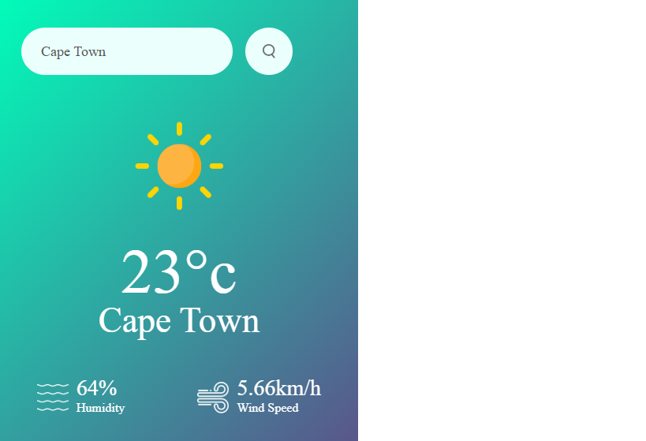

# 🌦️ Weather App

A simple and responsive weather application built using HTML, CSS, and JavaScript.

This app allows users to search for any city and view real-time weather data including temperature, humidity, and wind speed.

---

## 🚀 Features

- Search weather by city name
- Displays:
  - Temperature
  - Humidity
  - Wind speed
- Dynamic weather icons
- Error handling for invalid city names
- Clean and modern UI design

---

## 🛠️ Technologies Used

- HTML
- CSS
- JavaScript
- OpenWeather API

---

## 📷 App Screenshot

---
## 👩🏽‍💻 What I Learnt 

How to fetch data from an API

How to manipulate the DOM using JavaScript

How to deploy a project using GitHub Pages

How to manage version control using Git

## 🌍 Future Improvements

- Add 5-day forecast
- Add loading animation
- Improve mobile responsiveness
- Add dark mode toggle

---

## 👩🏽‍💻 Author

Candice Mhlanga  
GitHub: https://github.com/candiceluvstech
