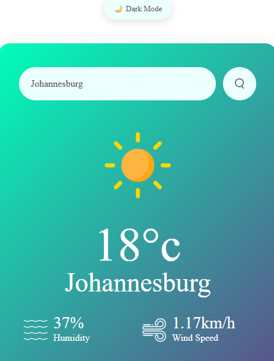
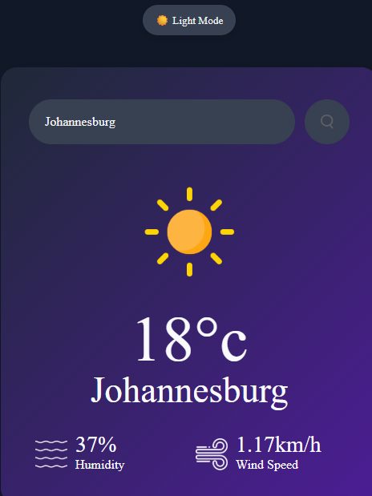

# 🌦️ Weather App

A modern responsive weather application built using HTML, CSS, and JavaScript that allows users to search for real-time weather information for any city using the OpenWeather API.

🚀 Live Demo

https://first
weatherdashboard.netlify.app/

---

## 🚀 Features

- Search weather by city name
- View real-time temparature
- Display humidity
- Display wind speed
- Dynamic weather icons based on weather conditions 
- Dark mode / Light mode toggle 
- Responsive design for mobile and desktop devices 
- Error handling for invalid city names

---

## 🛠️ Technologies Used

- HTML
- CSS
- JavaScript
- OpenWeather API
-Git & Github
-Netlify

---

## 📷 App Screenshots

### Light Mode

### Dark Mode

---
## 👩🏽‍💻 What I Learnt

Building this project helped me strengthen my skills in several areas, including:

- Fetching and displaying data from a real API
- Manipulating the DOM with JavaScript to update the UI dynamically
- Creating a responsive and user-friendly interface with HTML and CSS
- Implementing a dark mode and light mode toggle for better usability
- Deploying a project and managing it with Git and GitHub

## 🌍 Future Improvements

- Add 5-day weather forecast
- Display weather based on the user's current location 
- Add a loading spinner while data is being fetched
- Add a temparature unit toggle 

---

## 👩🏽‍💻 Author

Candice Mhlanga  
GitHub: https://github.com/candiceluvstech
